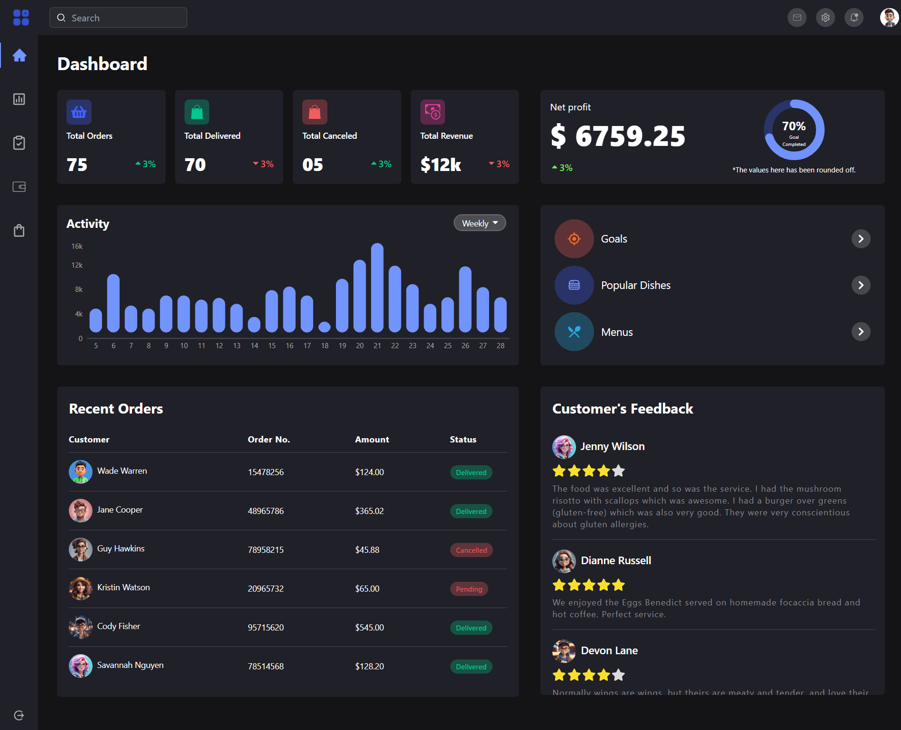

# Fitpeo Dashboard

🌐 Website - [fitpeo](https://fitpeo-ui.vercel.app/)



## Overview

This template integrates React with Vite, providing a streamlined development experience. It includes:

- HMR for fast development cycles.
- ESLint rules to maintain code quality.
- Two official plugins for React:
  - [@vitejs/plugin-react](https://github.com/vitejs/vite-plugin-react/blob/main/packages/plugin-react/README.md) using [Babel](https://babeljs.io/) for Fast Refresh.
  - [@vitejs/plugin-react-swc](https://github.com/vitejs/vite-plugin-react-swc) using [SWC](https://swc.rs/) for Fast Refresh.

## Technologies Used

- **React**: A JavaScript library for building user interfaces.
- **Vite**: A build tool that provides a fast development server and optimized builds.
- **Tailwind CSS**: A utility-first CSS framework for rapid UI development.
- **PostCSS**: A tool for transforming CSS with JavaScript plugins.
- **ESLint**: A tool for identifying and fixing problems in JavaScript code.
- **React Circular Progressbar**: A library for creating circular progress bars in React.
- **Recharts**: A library for creating customizable charts React.

## Getting Started

### Prerequisites

Ensure you have the following installed:

- [Node.js](https://nodejs.org/) (version 14 or higher)
- [npm](https://www.npmjs.com/) or [Yarn](https://yarnpkg.com/)

### Installation

1. Clone the repository:
   ```sh
   git clone https://github.com/debrajhyper/Fitpeo-Dashboard.git
   cd react-vite-project
   ```

2. Install dependencies:
    ```sh
    npm install
    ```

### Running the Project 
   Start the development server:
    
    npm run dev
    

Open your browser and navigate to http://localhost:3000 to see the application in action.

## Project Structure

    ├── public/                 # Static assets
    ├── src/                    # Source files
    │   ├── app/                # Main application components
    │   │   └── App.jsx         # Main App component
    │   ├── components/         # Reusable components
    │   ├── index.css           # Global styles
    │   └── main.jsx            # Entry point
    ├── .eslintrc.js            # ESLint configuration
    ├── vite.config.js          # Vite configuration
    ├── postcss.config.js       # PostCSS configuration
    ├── tailwind.config.js      # Tailwind CSS configuration
    └── package.json            # Project metadata and dependencies

## Available Scripts
- `npm run dev` / `yarn dev`: Starts the development server.
- `npm run build` / `yarn build`: Builds the project for production.
- `npm run serve` / `yarn serve`: Serves the production build locally.
- `npm run lint` / `yarn lint`: Runs ESLint to check for code quality issues.

## Contributing
I welcome contributions! Please follow these steps:

1. Fork the repository.
2. Create a new branch (`git checkout -b feature-branch`).
3. Make your changes.
4. Commit your changes (`git commit -m 'Add some feature'`).
5. Push to the branch (`git push origin feature-branch`).
6. Open a pull request.

## License
This project is licensed under the MIT License. See the LICENSE file for more details.